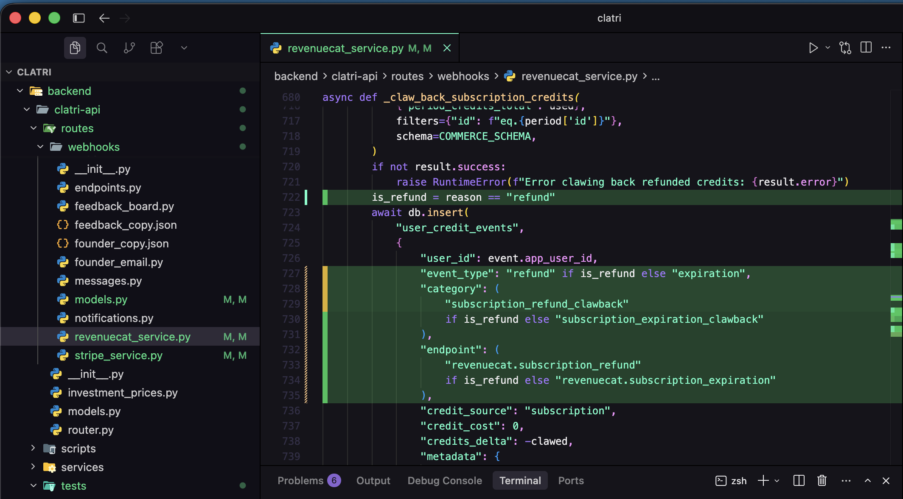
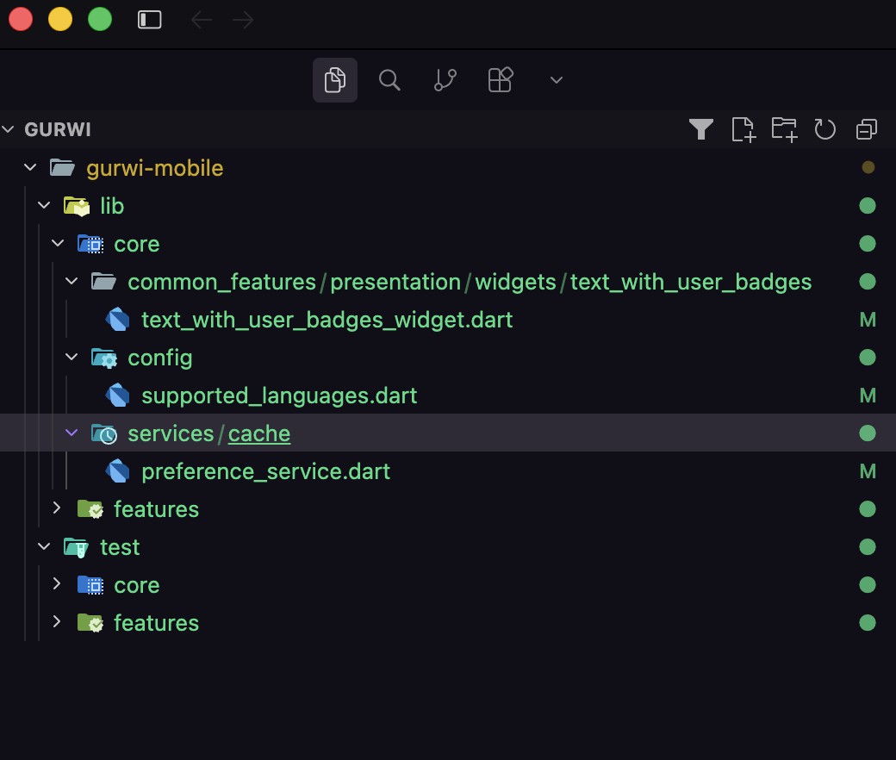

# Aggressive Git Diff

A **Cursor** and **VS Code** extension that aggressively highlights **every** current Git change in the workspace, always against `HEAD`.

There is no recording, no session, and no snapshot. The reference is automatic:

```text
HEAD  vs  current working tree
```

Conceptually: `git diff HEAD` (staged + unstaged).

## What it does

- **Added lines**: full-line green background.
- **Modified lines**: aggressive green/amber background on the new line.
- **Deleted lines**: each removed line is shown in place as red struck-through virtual text (`− the exact code`), not just a count.
- **Untracked files**: the entire file is painted as added.
- **Explorer**: files and folders with changes vs HEAD get a bright color and a badge (`M`, `U`, `A`, `D`).
- **Explorer filter**: a filter icon in the explorer title bar (next to New File) toggles a view that hides every file and folder without uncommitted changes.
- Opening a file that already had changes highlights them **immediately**.
- After a commit, if `HEAD === working tree`, highlighting clears on its own.
- Reacts to external edits (other agents, scripts, checkout, branch, reset) with debounce.
- Nested Git repositories work even when the workspace root itself is not a Git repo.

## Screenshots



Full-line green highlighting in the editor, and changed files/folders marked in the explorer versus `HEAD`.



The explorer filter hides every unchanged file and folder, so the tree collapses to the directories that actually contain working-tree changes versus `HEAD`. Click the filter icon in the explorer title bar to turn this on or off.

## Install in Cursor

1. Build the `.vsix` with `npm run package`.
2. In Cursor: **Extensions → … → Install from VSIX…**
3. Open a file with Git changes. Highlighting should appear without pressing any button.

```bash
cursor --install-extension aggressive-git-diff-0.1.5.vsix
```

## Commands

- `Aggressive Git Diff: Enable`
- `Aggressive Git Diff: Disable`
- `Aggressive Git Diff: Toggle`
- `Aggressive Git Diff: Refresh`
- `Aggressive Git Diff: Show Only Git Changes in Explorer`

A discreet `HEAD` item sits in the status bar. You do not need to use it; the extension runs on its own.

The explorer filter button stays on until you click it again. It hides unchanged files in the native explorer; turn it off to see the full tree. Native Git/Cursor revision diffs are left alone — highlighting only applies to regular file editors, so the built-in diff view no longer overlaps with this extension.

## Settings

```json
{
  "aggressiveGitDiff.enabled": true,
  "aggressiveGitDiff.addedBackground": "rgba(40, 200, 90, 0.28)",
  "aggressiveGitDiff.modifiedBackground": "rgba(40, 200, 90, 0.22)",
  "aggressiveGitDiff.deletedBackground": "rgba(255, 70, 70, 0.32)",
  "aggressiveGitDiff.opacity": 0.25,
  "aggressiveGitDiff.showDeletedIndicators": true,
  "aggressiveGitDiff.showDeletedContent": true,
  "aggressiveGitDiff.highlightWholeLine": true,
  "aggressiveGitDiff.highlightExplorer": true,
  "aggressiveGitDiff.debounceMs": 200,
  "aggressiveGitDiff.maxFileSizeKb": 1024
}
```

## Development

```bash
npm install
npm test
npm run compile
npm run build
npm run package
```

Press **F5** in Cursor/VS Code with this folder open to launch an Extension Development Host.

## Compatibility

Uses only public, stable VS Code extension APIs (`createTextEditorDecorationType`, `setDecorations`, `registerFileDecorationProvider`, watchers, commands, configuration). It does not depend on Cursor-internal APIs.
